# RecallKit


RecallKit turns your Markdown notes into interactive flashcards with **spaced repetition**.  


Your `.md` sections look like this:

```markdown
---
### Flashcard 1: Title
* **Question**: What is ... ?
* **Answer**:
    * bullet points
    * formulas: $$ y = ax + b $$
---
### Flashcard N: Title
* **Question**: What is ... ?
* **Answer**:
    * bullet points
    * formulas: $$ y = ax + b $$
---
```

## 🚀 How to Use

## Possible Workflow — can use NotebookLM or any LLM with RAG

```mermaid
flowchart LR
    A[Write Notes] --> B[Use NotebookLM or LLM with RAG<br>to Generate Flashcards]
    B --> C[Upload .md in GUI<br>📂 Manage Flashcards]
    C --> D[RecallKit Converts<br>to JSON + TSV]
    D --> E[Study in GUI<br>🎓 FlashCards Tab]
    E --> F[Progress Synced<br>LocalStorage / FastAPI]

```



### 1. Run with Docker (recommended)

```bash
docker compose up --build
```

Then open [http://localhost:8501](http://localhost:8501) in your browser.

---

### 2. Upload & Manage Multi Library

* Go to **📂 Manage Flashcards** tab.
* Enter a topic name (e.g. `time_series`) and upload one or more `.md` files.
* Flashcards are parsed and saved into `web/build/<topic>.json` + `<topic>.tsv`.
* You can delete sets individually.

---

### 3. Study

* Switch to the **🎓 FlashCard** tab.
* Choose a topic (or “All”) and optionally filter by tag.
* Use the interface to flip cards, reveal answers, and mark *Again / Hard / Good / Easy*.
* Progress is tracked with a simple Leitner-style system stored in your browser and sync to server.

---

### 4. Optional Exports

* Download flashcards as:

  * `cards.json` (for re-use)
  * `quizlet.tsv` (import into Quizlet)

---

## 📝 Notes

* Supports **Markdown** rendering and **LaTeX formulas** (via KaTeX).
* Each topic is independent, so you can keep multiple subjects (e.g. *maths*, *time series*, *statistics*).

